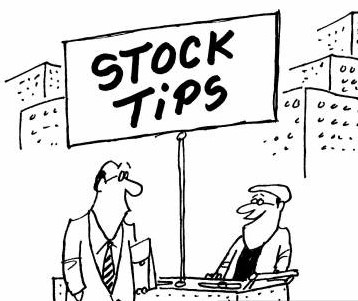

# Selection of Stocks for Investment using Quantitative Strategies

  

  

    This project implements various investing strategies for computing how many and which shares of S&P 500 someone should purchase.
  

 

## Project Structure

| Number |                                                                                Notebook                                                                                 | Description                                                                                                                    |
| :----: | :---------------------------------------------------------------------------------------------------------------------------------------------------------------------: | ------------------------------------------------------------------------------------------------------------------------------ |
|   01   |         [Equal-Weight S&P 500 Index Fund ](https://github.com/SaudIqbal-IITM/stocks-selection-quantitative/blob/main/notebooks/01_equal_weight_S%26P_500.ipynb)         | Computes how many shares of each S&P 500 constituent someone should purchase to get an equal-weight version of the index fund. |
|   02   | [Quantitative Momentum Investing Strategy](https://github.com/SaudIqbal-IITM/stocks-selection-quantitative/blob/main/notebooks/02_quantitative_momentum_strategy.ipynb) | Investing strategy that selects 50 stocks with highest price momentum.                                                         |
|   03   |    [Quantitative Value Investing Strategy](https://github.com/SaudIqbal-IITM/stocks-selection-quantitative/blob/main/notebooks/03_quantitative_value_strategy.ipynb)    | Investing strategy that selects 50 stocks with best value metrics.                                                             |

 

## References

- [Algorithmic Trading Using Python](https://www.youtube.com/watch?v=xfzGZB4HhEE)
